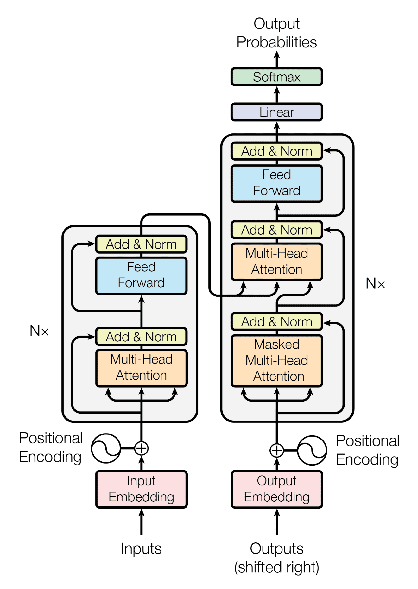

# Transformer From Scratch (EN → IT Translation)

A complete implementation of the original **Transformer Encoder–Decoder architecture** built entirely from scratch in **PyTorch** for English → Italian machine translation.

This project recreates the architecture proposed in the paper:

> **Attention Is All You Need**  
> Vaswani et al., 2017

Instead of relying on pretrained models, every major component of the Transformer was implemented manually to gain a deeper understanding of modern sequence-to-sequence architectures.

---

# Features

- Transformer implemented completely from scratch
- Multi-Head Self Attention
- Scaled Dot Product Attention
- Positional Encoding
- Residual Connections
- Layer Normalization
- Feed Forward Networks
- Encoder–Decoder Cross Attention
- Causal Masking
- Greedy Autoregressive Decoding
- BLEU Score Evaluation
- End-to-End Training Pipeline

---

# Tech Stack

- Python
- PyTorch
- Hugging Face Datasets
- Hugging Face Tokenizers
- TensorBoard
- SacreBLEU

---

# Dataset

**OPUS Books**

Task:

```
English → Italian Machine Translation
```

Custom Word-Level tokenizers are trained separately for both English and Italian.

---

# Model Architecture

The implementation closely follows the original Transformer architecture.

<p align="center">
  
</p>

## Encoder

- Input Embedding
- Positional Encoding
- Multi-Head Self Attention
- Feed Forward Network
- Residual Connections
- Layer Normalization

---

## Decoder

- Masked Multi-Head Self Attention
- Encoder–Decoder Cross Attention
- Feed Forward Network
- Residual Connections
- Layer Normalization

---

## Output Layer

The decoder output is projected to the target vocabulary using a linear layer followed by LogSoftmax.

---

# Attention

Scaled Dot Product Attention

```
Attention(Q,K,V)
=
softmax(QKᵀ / √dₖ)V
```

Multi-Head Attention

```
MultiHead(Q,K,V)
=
Concat(head₁,...,headₕ)Wᵒ
```

---

# Masking Strategy

Two masking mechanisms are implemented.

### Source Mask

Allows the encoder to attend to all valid source tokens.

### Target Causal Mask

Uses a lower triangular mask to prevent the decoder from accessing future tokens during training and inference.

---

# Training Configuration

| Parameter | Value |
|-----------|------:|
| Framework | PyTorch |
| Device | Apple MPS |
| Epochs | 20 |
| Batch Size | 8 |
| Optimizer | Adam |
| Loss | Cross Entropy |
| Dataset | OPUS Books |

---

# Evaluation

Model quality is evaluated using **SacreBLEU** on a held-out validation split.

Evaluation pipeline includes:

- Greedy Decoding
- Corpus-level BLEU Score
- Validation Set Evaluation

Example:

```python
bleu = sacrebleu.corpus_bleu(predictions, [references])
```

---

# Repository Structure

```
.
├── final_model/
│   ├── transformer_weights.pt
│   ├── tokenizer_en.json
│   └── tokenizer_it.json
│
├── transformer.py          # Transformer architecture
├── transformer.ipynb       # Development notebook
├── infer.py                # Translation inference
├── evaluate.py             # BLEU evaluation
├── tokenizer_en.json
├── tokenizer_it.json
├── README.md
└── LICENSE
```

---

# Key Concepts Implemented

- Transformer Encoder
- Transformer Decoder
- Multi-Head Attention
- Cross Attention
- Positional Encoding
- Layer Normalization
- Residual Connections
- Feed Forward Networks
- Padding Masks
- Causal Masks
- Teacher Forcing
- Greedy Decoding
- BLEU Evaluation

---

# Learning Outcomes

Through this project I gained practical experience with:

- Building deep learning architectures from research papers
- Implementing attention mechanisms from scratch
- Tensor manipulation for multi-head attention
- Sequence-to-sequence learning
- Machine Translation
- Tokenization pipelines
- Model evaluation using BLEU
- End-to-end training and inference in PyTorch

---

# Future Improvements

- Beam Search Decoding
- Label Smoothing
- Learning Rate Warmup (Noam Scheduler)
- Mixed Precision Training
- Attention Visualization
- Larger multilingual datasets
- Comparison against pretrained translation models

---

# Running the Project

Clone the repository.

```bash
git clone https://github.com/dheeraj25406/transformer-from-scratch.git
cd transformer-from-scratch
```

Install dependencies.

```bash
pip install -r requirements.txt
```

Run inference.

```bash
python infer.py
```

Evaluate the model.

```bash
python evaluate.py
```

---

# Author

**Dheeraj Alamuri**

B.Tech (Artificial Intelligence)

Interested in Machine Learning Engineering, Deep Learning, NLP, Generative AI, and Large Language Models.
